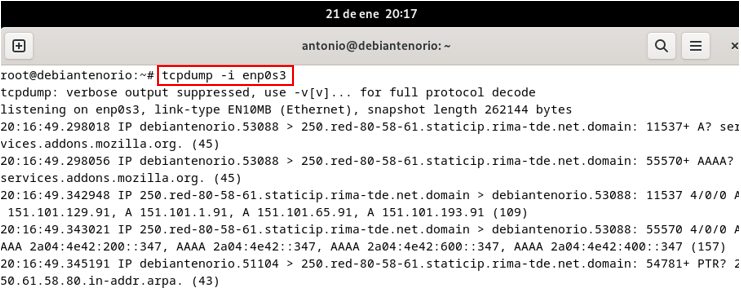
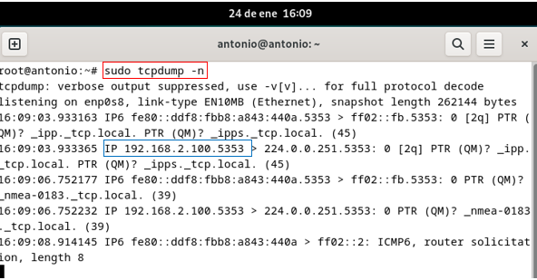

# Monitorización de la red.
## Comando tcpdump.
## 3.1	Explicación del comando.
El comando tcpdump es una herramienta esencial en sistemas Unix/Linux para capturar y analizar tráfico de red en tiempo real. Es utilizado por administradores para diagnosticar problemas, monitorear tráfico y detectar actividades sospechosas, examinando los datos que pasan por una interfaz de red.

**Sintaxis básica**:
tcpdump [opciones] [expresión de filtro]
## 3.2	Opciones comunes del comando.
-	**-i [nombre_interfaz]**: Especifica la interfaz de red para capturar tráfico (por defecto selecciona la interfaz activa). 
-	**-n**: No resuelve nombres de host ni puertos (muestra direcciones IP y números de puerto).
-	**-v, -vv, -vvv**: Aumenta el nivel de detalle de la salida.
-	**-c [número]**: Captura un número específico de paquetes.
-	**-w [archivo]**: Guarda los paquetes capturados en un archivo para analizarlos más tarde con herramientas como Wireshark.
-	**-r [archivo]**: Lee paquetes desde un archivo guardado.
-	**-s [snaplen]**: Especifica el tamaño del paquete a capturar (por defecto 96 bytes, usa 0 para capturar todo el paquete).
## 3.3	Capturas de pantalla ejecutando las opciones.

## 3.4	Comentario del resultado del comando.
-	**tcpdump -i enp0s3**: Especifica la interfaz de red para capturar tráfico (por defecto selecciona la interfaz activa).
-	**tcpdump -c**: Captura un número específico de paquetes.
-	**tcpdump -n**: Muestra direcciones IP y números de puerto.
  
## Comando tcptrack.
## 3.1	Explicación del comando.
Es una herramienta de monitorización en tiempo real diseñada para observar conexiones TCP activas, ofreciendo información clave como:
-	Direcciones IP de origen y destino.
-	Puertos involucrados en la conexión.
-	Estado actual de cada conexión.
-	Cantidad de datos transmitidos.
Además, también presenta los datos de manera visual, facilitando el análisis en vivo del tráfico de red, siendo útil para supervisar la actividad de red en detalle.

**Sintaxis básica**:
sudo tcptrack -i enp0s3
## 3.2	Opciones comunes del comando.
-	**-i enp0s3**: Especifica la interfaz de red a monitorear, como eth0 o wlan0.
-	**-d**: Activa el modo de depuración, proporcionando información adicional para diagnósticos.
-	**-f <filtro>**: Permite aplicar filtros en el formato de tcpdump para analizar tráfico específico (por ejemplo, filtrar por protocolo 
  o puerto).
-	**-r 3**: Ajusta la velocidad de actualización en la pantalla (por defecto es 1 segundo).
-	**-r <archivo>**: Analiza un archivo de captura de paquetes previamente generado, como los creados con tcpdump o Wireshark.
-	**-v**: Muestra la versión de la herramienta.
-	**-h**: Muestra la ayuda con una lista de todas las opciones disponibles.
## 3.7	Capturas de pantalla ejecutando las opciones.
