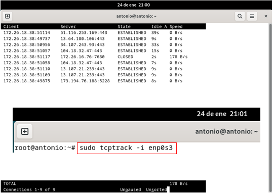
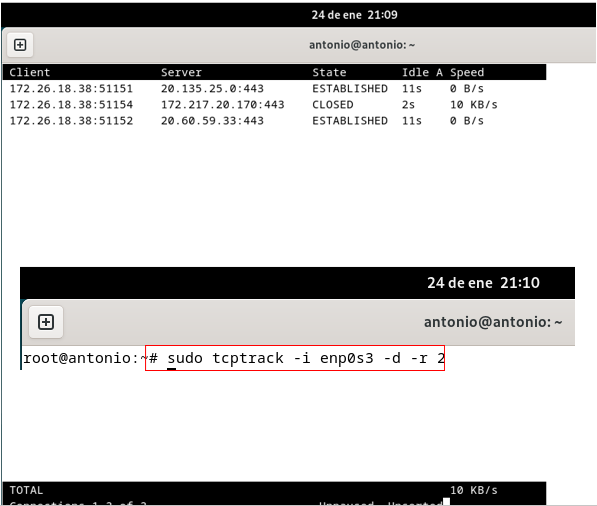
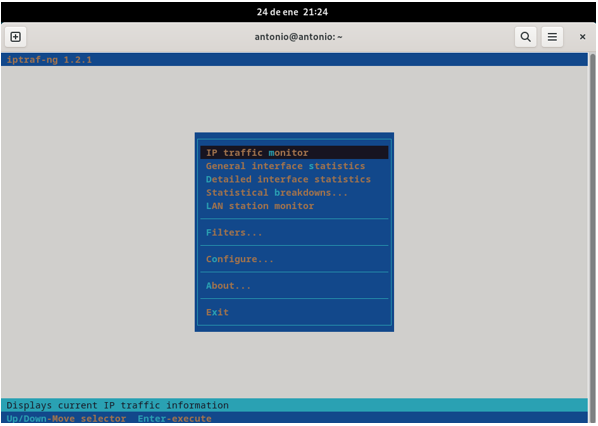
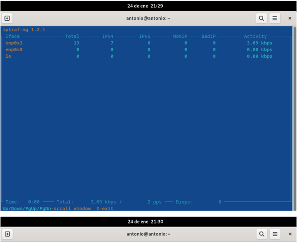
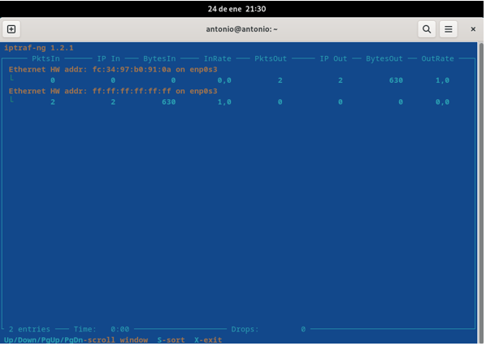
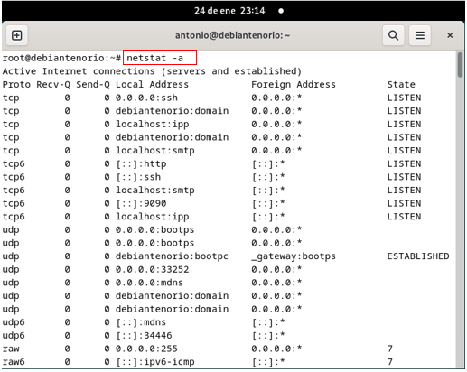
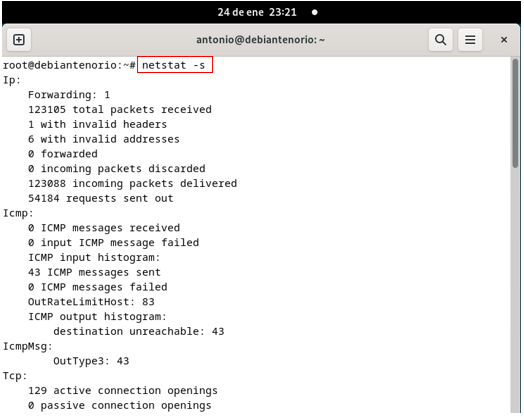
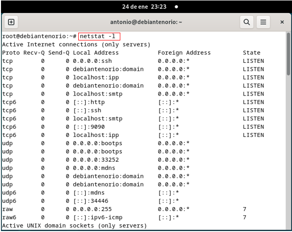

# 3. Monitorización de la red.

## Comando tcpdump.
## 3.1	Explicación del comando.
El comando tcpdump es una herramienta esencial en sistemas Unix/Linux para capturar y analizar tráfico de red en tiempo real. Es utilizado por administradores para diagnosticar problemas, monitorear tráfico y detectar actividades sospechosas, examinando los datos que pasan por una interfaz de red.

**Sintaxis básica**:
tcpdump [opciones] [expresión de filtro]
## 3.2	Opciones comunes del comando.
-	**-i [nombre_interfaz]**: Especifica la interfaz de red para capturar tráfico (por defecto selecciona la interfaz activa). 
-	**-n**: No resuelve nombres de host ni puertos (muestra direcciones IP y números de puerto).
-	**-v, -vv, -vvv**: Aumenta el nivel de detalle de la salida.
-	**-c [número]**: Captura un número específico de paquetes.
-	**-w [archivo]**: Guarda los paquetes capturados en un archivo para analizarlos más tarde con herramientas como Wireshark.
-	**-r [archivo]**: Lee paquetes desde un archivo guardado.
-	**-s [snaplen]**: Especifica el tamaño del paquete a capturar (por defecto 96 bytes, usa 0 para capturar todo el paquete).
## 3.3	Capturas de pantalla ejecutando las opciones.

## 3.4	Comentario del resultado del comando.
-	**tcpdump -i enp0s3**: Especifica la interfaz de red para capturar tráfico (por defecto selecciona la interfaz activa).
-	**tcpdump -c**: Captura un número específico de paquetes.
-	**tcpdump -n**: Muestra direcciones IP y números de puerto.
  
## Comando tcptrack.
## 3.1	Explicación del comando.
Es una herramienta de monitorización en tiempo real diseñada para observar conexiones TCP activas, ofreciendo información clave como:
-	Direcciones IP de origen y destino.
-	Puertos involucrados en la conexión.
-	Estado actual de cada conexión.
-	Cantidad de datos transmitidos.
Además, también presenta los datos de manera visual, facilitando el análisis en vivo del tráfico de red, siendo útil para supervisar la actividad de red en detalle.

**Sintaxis básica**: sudo tcptrack -i enp0s3
## 3.2	Opciones comunes del comando.
-	**-i enp0s3**: Especifica la interfaz de red a monitorear, como eth0 o wlan0.
-	**-d**: Activa el modo de depuración, proporcionando información adicional para diagnósticos.
-	**-f <filtro>**: Permite aplicar filtros en el formato de tcpdump para analizar tráfico específico (por ejemplo, filtrar por protocolo 
  o puerto).
-	**-r 3**: Ajusta la velocidad de actualización en la pantalla (por defecto es 1 segundo).
-	**-r <archivo>**: Analiza un archivo de captura de paquetes previamente generado, como los creados con tcpdump o Wireshark.
-	**-v**: Muestra la versión de la herramienta.
-	**-h**: Muestra la ayuda con una lista de todas las opciones disponibles.
## 3.3	Capturas de pantalla ejecutando las opciones.

## 3.4	Comentario del resultado del comando.
-	**sudo tcptrack -i enp0s3**: Especifica la interfaz de red, su estado, velocidad, ip del servidor, etc.
-	**sudo tcptrack -i enp0s3 -d –r 2**: Especifica la interfaz de red, su estado, velocidad, ip del servidor y el tiempo que la ip está 
  inactiva.
 	
## Comando iptraf-ng.
## 3.1	Explicación del comando.
Es una herramienta interactiva de consola para monitorizar el tráfico de red en tiempo real en sistemas Linux. Es una versión mejorada de la clásica iptraf, ofreciendo mayor estabilidad y funcionalidades ampliadas. Está orientada a administradores de sistemas, permitiendo analizar el uso de la red en interfaces específicas, rastrear conexiones activas y obtener estadísticas detalladas del tráfico de red.
## 3.2	 Opciones comunes del comando.
-	__iptraf-ng__: Esto abrirá un menú interactivo donde podremos seleccionar la opción que necesitemos.
-	__IP Traffic Monitor__: Monitorea el tráfico IP detallado en tiempo real.
-	__General Interface Statistics__: Estadísticas generales de las interfaces de red.
-	__Detailed Interface Statistics__: Estadísticas más detalladas de una interfaz específica.
-	__Statistical Breakdown by Address__: Tráfico dividido por dirección IP.
-	__Statistical Breakdown by Port__: Tráfico dividido por puerto.
-	__Configure...__: Opciones de configuración de la herramienta.
## 3.3	 Capturas de pantalla ejecutando las opciones.

## 3.4	 Comentario del resultado del comando.
-	iptraf-ng: Esto abrirá un menú interactivo donde podremos elegir las distintas opciones que aparecen.
-	IP Traffic Monitor: Monitorea el tráfico IP detallado en tiempo real.
-	General Interface Statistics: Opción (enp0s3) Estadísticas generales de las interfaces de red.
  
## Comando netstat.
## 3.1   Explicación del comando.
Es una herramienta de línea de comandos ampliamente utilizada para supervisar conexiones de red, estadísticas, sockets y puertos abiertos en un sistema. Es especialmente útil para tareas de administración y diagnóstico de redes. Aunque el comando netstat ha sido reemplazado en algunos sistemas por herramientas más modernas como ss, sigue siendo muy utilizado.
## 3.2	 Opciones comunes del comando.
-	**-a**: Muestra todas las conexiones activas y los puertos en escucha.
-	**-s**: Proporciona un desglose de las estadísticas por protocolos (TCP, UDP, ICMP, etc.).
-	**-l**: Muestra los puertos en escucha.
-	**-tp**: Lista las conexiones junto con los procesos o aplicaciones que las están utilizando.
-	**-n**: Evita resolver nombres de host y muestra las direcciones IP directamente.
-	**-r**: Muestra la tabla de enrutamiento del sistema.
## 3.3	 Capturas de pantalla ejecutando las opciones.

## 3.4	 Comentario del resultado del comando.
-	**netstat -a**: Muestra los protocolos, direcciones locales y los puertos en escucha.
-	**netstat -s**: Nos proporciona un desglose de las estadísticas por protocolos (TCP, UDP, ICMP, etc.)
-	**netstat -l**: Muestra los protocolos, direcciones locales y el estado de los puertos en escucha.
-	**Netstat -r**: Nos muestra las ip, puerta de enlace, máscara, interfaz, etc.
