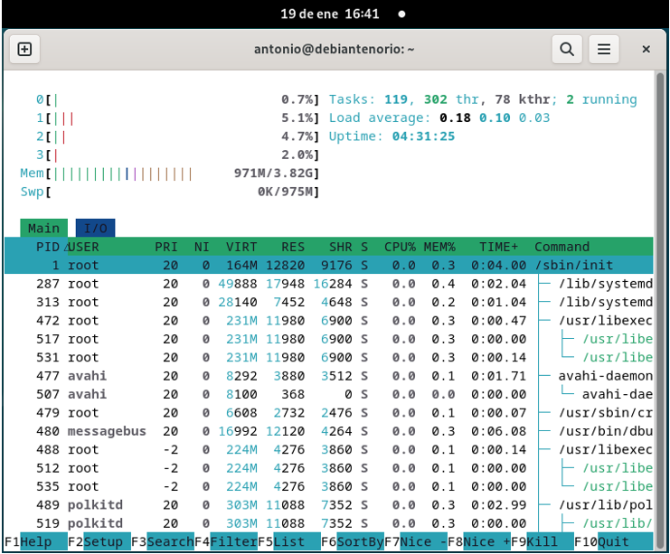

# Monitorización de procesos

## Comando ps 
## 1.1 Explicación del comando.  
El comando **ps** es una herramienta fundamental que proporciona una instantánea de los procesos en ejecución. Es útil para obtener información específica sobre los procesos en un sistema Linux.  

## 1.2 Opciones comunes del comando.  
El comando **ps** en Linux tiene muchas opciones útiles para mostrar información sobre los procesos en ejecución:  

- **ps**: Muestra una lista de procesos.  
- **ps a**: Muestra los procesos de todos los usuarios/as.  
- **ps -C nano y ps -C nano 3836** (número PID): Filtra los procesos que coinciden con el nombre exacto del comando `nano` y muestra el 
    campo de identificador de proceso (PID).  
- **ps -f**: Muestra una lista completa con información detallada.  
- **ps -l**: Muestra una lista larga de procesos con información detallada.  
- **ps -o vsz**: Muestra el tamaño total de la memoria virtual utilizada por un proceso, expresado en kilobytes (Virtual Memory Size).  
- **ps -p 3836**: Muestra información sobre un proceso específico por su ID de proceso (PID).  
- **ps u**: Muestra la información en formato legible, tipo lista o tabla.  
- **ps -u Antonio**: Muestra los procesos del usuario/a especificado.  
- **ps x**: Muestra los procesos sin terminal.  

## 1.3 Capturas de pantalla ejecutando las opciones.  

## 1.4 Comentario del resultado del comando.   

- **ps**: Nos muestra el identificador del proceso en ejecución. El PID 1 está reservado para el sistema (como `systemd` o `init`). También identifica la terminal física o virtual, como `tty1`, `tty2`, etc., el tiempo total de CPU utilizado, incluyendo el tiempo de usuario (user time) y el tiempo de sistema (system time), además del nombre del comando que se ejecutó en el proceso.  

- **ps a**: Además de lo anterior, muestra el estado del proceso, que puede ser:  
  - **S** (Sleeping - Durmiendo): Inactivo.  
  - **R** (Running - Corriendo): Ejecutándose.  
  - **D** (Uninterruptible sleep): Durmiendo ininterrumpidamente.  
  - **T** (Stopped - Detenido): Detenido.  
  - **Z** (Zombie): Terminado.  

- **ps -C nano y ps -C nano 3836 (número PID)**: Muestra todo lo anterior y además indica que el proceso está en primer plano, es decir, interactúa directamente con el terminal.  

- **ps -f**: Además de algunos de los datos anteriores, muestra:  
  - El ID del usuario/a.  
  - El ID del proceso y del proceso padre (PPID).  
  - La proporción de tiempo que el proceso ha estado activo en la CPU. Un valor más alto sugiere que el proceso ha consumido más recursos de CPU.  

- **ps -l**: Además de lo anterior, incluye:  
  - **PRI (Priority - Prioridad):** Prioridad del proceso para ser programado en la CPU.  
  - **NI (Nice Value - Valor de Amabilidad):** Representa la prioridad o "amabilidad" del proceso hacia otros.  
  - **ADDR (Address - Dirección de Memoria):** Indica la dirección en memoria donde se carga el proceso.  
  - **WCHAN (Waiting Channel - Canal de Espera):** Muestra el nombre del kernel o función en la que el proceso está esperando.  

- **ps -o**: Nos permite especificar el formato de salida de la información.  

- **ps -o vsz**: Muestra el tamaño total de la memoria virtual utilizada por el proceso.  

- **ps -p 3836**: Muestra información sobre un proceso específico por su ID de proceso (PID).  

- **ps u**: Además de lo anterior, muestra:  
  - El porcentaje del tiempo de CPU (%CPU) utilizado por un proceso en relación con el total disponible.  
  - El porcentaje de memoria física total (%RAM) utilizada por un proceso.  

- **ps -u antonio**: Muestra los procesos asociados al usuario especificado.  

- **ps x**: Muestra los procesos que no están asociados a un terminal.

## Comando top
## 1.1	Explicación del comando.
El comando top en Linux es una herramienta interactiva que permite monitorizar el sistema en tiempo real. Proporciona una vista dinámica de los procesos en ejecución y del uso de recursos, como CPU, memoria y procesos activos. Es útil para identificar procesos que consumen muchos recursos y gestionar el rendimiento del sistema.
Sintaxis básica: top [opciones]
## 1.2	Opciones comunes del comando.
El comando top en Linux ofrece varias opciones útiles para monitorear y gestionar los procesos del sistema.
-	**top -b**: Ejecuta top en modo batch, útil para redirigir la salida a un archivo.
-	**top -c**: Nos muestra la línea de comando completa de cada proceso en lugar del nombre del comando.
-	**top -d 5**: Establece un intervalo de actualización de la pantalla cada 5 segundos. Por defecto, es 3 segundos.
-	**top -n 3**: Nos muestra un número específico de actualizaciones y luego sale.
-	**top -u antonio**: Nos muestra solo los procesos del usuario especificado.
-	**top -p 3314**: Muestra solo el proceso con el ID de proceso (PID) especificado. 
Las opciones y comandos interactivos de top nos permiten personalizar y controlar la visualización de los procesos en tiempo real. Estas herramientas son útiles para adaptar la información mostrada a nuestras necesidades, como ordenar por uso de CPU, memoria o filtrar por usuario. Además, dentro de la interfaz de top, podemos interactuar mediante comandos específicos para gestionar la forma en que se presentan los datos.
-	**h**: Nos muestra la ayuda.
-	**k**: Mata un proceso especificando su PID.
-	**r**: Renombra (cambia la prioridad) de un proceso.
-	**q**: Sale de top.
-	**s**: Cambia el intervalo de actualización.
## 1.3	Capturas de pantalla ejecutando las opciones.

## 1.8	Comentario del resultado del comando.
-	**top**: En la cabecera superior, podemos ver la hora de la conexión, el número de usuarios conectados al sistema (1 **user**), carga media (**load average**) valores que representan la carga media del sistema en los últimos 1,5 y 15 minutos, las tareas con su número de procesos totales, en ejecución (**running**), suspendidos (**sleeping**) y detenidos (**stopped**), muertos (**zombie**), estado de la CPU en porcentaje de uso divididos en: 
- Usuario (**us**): Procesos del usuario.
- Sistema (**sy**): Procesos del sistema (kernel).
- Idle (**id**): Tiempo que la CPU está inactiva.
- Otros: Tiempo dedicado a interrupciones, espera de E/S, etc.
Memoria (**Mem**): Memoria total, utilizada, libre y en caché, swap memoria para el espacio de intercambio.
En la **parte inferior**, tabla de procesos podemos ver:
- **PID**: Identificador del proceso.
- **USER**: Usuario/a que ejecuta el proceso.
- **PR**: Prioridad del proceso.
- **NI**: Valor de nice (afecta la prioridad del proceso).
- **VIRT**: Memoria virtual utilizada.
- **RES**: Memoria física utilizada.
- **SHR**: Memoria compartida.
- **S**: Estado del proceso (ejecución, suspensión, etc.).
- **%CPU**: Porcentaje de uso de la CPU.
- **%MEM**: Porcentaje de uso de la memoria.
- **TIME+**: Tiempo total de CPU consumido.
- **COMMAND**: Nombre o comando asociado al proceso.
- **top -b**: Nos permite salida en texto plano de la información sobre los procesos y el sistema imprimiéndola directamente en la terminal, ideal para redirigirla a un archivo, script o para utilizarla en análisis automatizados.
top -b > salida.txt
- **top -c**: Nos mostrará directamente los comandos completos de los procesos.
- **top -d 5**: Ajustamos el intervalo de actualización de la salida de top a 5 segundos, con la opción -d personalizamos el tiempo.
- **top -n 3**: Va a limita la cantidad de actualizaciones o iteraciones que realiza top antes de salir.
- **top -u antonio**: Nos muestra solo los procesos del usuario.
- **top -p 3314**: Muestra solo el proceso con el ID de proceso (PID) especificado. 
Las opciones y **comandos interactivos** de top.
- **h**: Nos muestra la ayuda con distintas opciones para elegir.
- **k**: Mata un proceso especificando su PID (detiene).

## Comando htop.
## 1.9	Explicación del comando.
Es una versión mejorada de top, con una interfaz interactiva, más amigable y colorida. Ofrece funcionalidades adicionales que facilitan la monitorización del sistema y permiten una visualización más intuitiva de los procesos en ejecución.

**Sintaxis básica**: htop [opciones]

## 1.10	Opciones comunes del comando.
- **htop**: Es una versión mejorada y más amigable de top, con una interfaz interactiva y funcionalidad adicional.
- **htop -d 3**: Establece el intervalo de actualización en milisegundos.
- **htop -u antonio**: Muestra solo los procesos del usuario especificado.
- **htop -p 3314,3315**: Muestra solo los procesos con los IDs de proceso (PIDs) especificados.
- **htop -t y --tree**: Muestra los procesos y subprocesos en una vista de árbol.
  
Las opciones y **comandos interactivos** de top.
- **F1**: Muestra la ayuda.
-	**F2**: Abre el menú de configuración.
-	**F3**: Busca un proceso por nombre.
-	**F4**: Filtra los procesos por nombre.
-	**F5**: Cambia a la vista de árbol.
-	**F6**: Cambia el criterio de ordenación.
-	**F9**: Mata un proceso especificando su PID.
-	**F10**: Sale de htop.
  
## 1.11	Capturas de pantalla ejecutando las opciones.

## 1.12	Comentario del resultado del comando.
-	**htop**: En la cabecera superior, podemos ver la hora de la conexión, carga media (load average) valores que representan la carga media del sistema en los últimos 1,5 y 15 minutos, las tareas con su número de procesos totales, en ejecución (running), número de núcleos de la CPU, memoria (Mem), memoria total, utilizada, libre y en caché, swap memoria para el espacio de intercambio.
En la parte inferior, tabla de procesos vemos los mismos procesos que en el comando top.
-	**htop -d 3**: La Información general del sistema (cabecera y parte inferior), es igual que la del comando htop, la diferencia está en la información se actualiza más rápidamente.
-	**htop -u antonio**: Muestra la misma información que el comando htop, pero del usuario especificado.
-	**htop -p 3314,3315**: Muestra la misma información del comando htop, mostrando sólo los procesos con los IDs de proceso (PIDs) especificados.
-	**htop -t y --tree**: Muestra los procesos y subprocesos en una vista de árbol, mostrando los mismos datos que el comando htop.

Las opciones y **comandos interactivos** de htop.
-	**F1 (help)**: Muestra la ayuda del comando una vez dentro, pulsando la tecla F1.
-	**F3 (search)**: Abre un campo para que busques un proceso por nombre, o cualquier otro dato.

## Comando atop.
## 1.13	Explicación del comando.
Es una herramienta avanzada para monitorear el rendimiento del sistema en Linux. A diferencia de top y htop, atop ofrece una visión más detallada y persistente del uso de recursos, incluyendo CPU, memoria, disco y red. Además, permite registrar datos para su análisis posterior, lo que lo convierte en una herramienta ideal para diagnósticos y monitoreo a largo plazo.
## 1.14	Opciones comunes del comando.
-	**atop -a**: Muestra todos los procesos, incluyendo aquellos que han terminado durante el intervalo de muestreo.
-	**atop -d**: Muestra información detallada sobre el uso del disco.
-	**atop -m**: Muestra información detallada sobre el uso de la memoria.
-	**atop -n**: Muestra información detallada sobre el uso de la red.
-	**atop -u**: Muestra información detallada sobre el uso de la CPU.
Las opciones y **comandos interactivos** de top.
-	**t**: Cambia el intervalo de actualización.
-	**c**: Cambia la visualización de los comandos completos.
-	**d**: Cambia la visualización de los detalles del disco.
-	**m**: Cambia la visualización de los detalles de la memoria.
-	**n**: Cambia la visualización de los detalles de la red.
-	**q**: Sale de atop.
## 1.15	Capturas de pantalla ejecutando las opciones.

## 1.16	Comentario del resultado del comando.
-	**atop**: Nos muestra datos específicos del intervalo actual de muestreo.
-	**atop -a**: Muestra la actividad total acumulada desde que los procesos comenzaron, de CPU, memoria, disco y red, estadísticas del sistema como tiempo de actividad, carga promedio, y cantidad total de procesos.
-	**atop -d**: Muestra porcentaje de tiempo que el disco ha estado ocupado procesando, los que están activos, nombre del comando completo, los que están en estado zombi (terminado), etc.
-	**atop -m**: Cantidad total de memoria RAM disponible en el sistema, utilizada por el sistema y los procesos, espacio de intercambio total y utilizado.
-	**atop -u**: Se enfoca específicamente en cómo los procesos y el sistema están utilizando los recursos de procesamiento, mostrando el porcentaje de uso de la CPU.
  
Las opciones y **comandos interactivos** de top.
-	**d**: Cambia la visualización de los detalles del disco.
-	**m**: Cambia la visualización de los detalles de la memoria.
