# 2. Monitorización del almacenamiento.

## Comando free.
## 2.1	Explicación del comando.
El comando free en sistemas operativos basados en Linux sirve para mostrar información detallada sobre el uso de la memoria del sistema. 
Incluye datos sobre:
Memoria física (RAM): Memoria libre y utilizada.
Memoria de intercambio (swap): Espacio asignado para ampliar la memoria virtual.
Buffers y cachés del sistema: Recursos usados para optimizar el rendimiento.
Es una herramienta útil para monitorear el estado de la memoria y diagnosticar problemas relacionados con su gestión.
## 2.2	Opciones comunes del comando.
-	__free__: Muestra información del uso de la memoria RAM (libre y utilizada).
-	__-b__: Muestra la memoria en bytes.
-	__-k__: Muestra la memoria en kilobytes (por defecto).
-	__-m__: Muestra la memoria en megabytes.
-	__-g__: Muestra la memoria en gigabytes.
-	__-h__: Muestra los valores en un formato legible para humanos (por ejemplo, 2.0G en lugar de 2097152).
-	__-t__: Muestra una fila adicional con el total de memoria (RAM + swap).
## 2.3	Capturas de pantalla ejecutando las opciones.
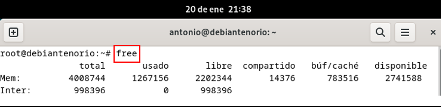

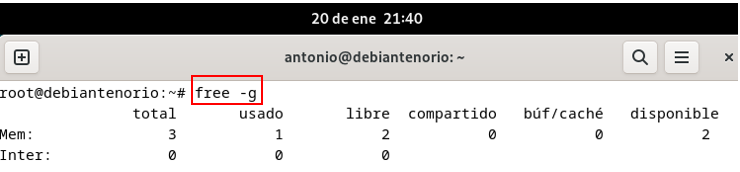
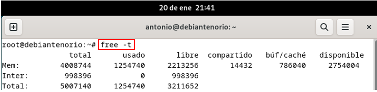

## 2.4 Comentario del resultado del comando.
-	**free**: Muestra información sobre el uso de la memoria RAM del sistema.
-	**free -b**: Muestra información de la memoria en bytes.
-	**free -b**: Muestra la memoria en gigabytes.
-	**free -t**: Muestra una fila adicional con el total de memoria (RAM + swap).
Descripción de las columnas:
-	__total__: Memoria total del sistema.
-	__usado__: Memoria en uso.
-	__libre__: Memoria libre (sin usar en absoluto).
-	__compartido__: Memoria compartida entre procesos.
-	__buf/cache__: Memoria usada por buffers y cachés del sistema.
-	__disponible__: Memoria realmente disponible para ser usada por aplicaciones.
  
## Comando df.
## 2.1	Explicación del comando.
El comando df en Linux muestra información sobre el uso y la disponibilidad de espacio en los sistemas de archivos montados. Permite conocer:
Espacio de disco utilizado.
Espacio de disco libre.
Es una herramienta útil para monitorear y gestionar el almacenamiento en discos y particiones.
## 2.2	Opciones comunes del comando.
-	**df**: Muestra el espacio utilizado y disponible en los sistemas de archivos montados.
-	**-h**: Muestra los valores en un formato legible para humanos (por ejemplo, 1G en lugar de 1073741824).
-	**-k**: Muestra los tamaños en kilobytes (por defecto).
-	**-m**: Muestra los tamaños en megabytes.
-	**-T**: Muestra el tipo del sistema de archivos (ext4, xfs, etc.).
-	**-i**: Muestra el uso de inodos en lugar del espacio en disco.
-	**--total**: Muestra un total acumulado de todas las entradas listadas.
-	**--output**: Permite personalizar las columnas que se muestran en la salida.
## 2.3	Capturas de pantalla ejecutando las opciones.
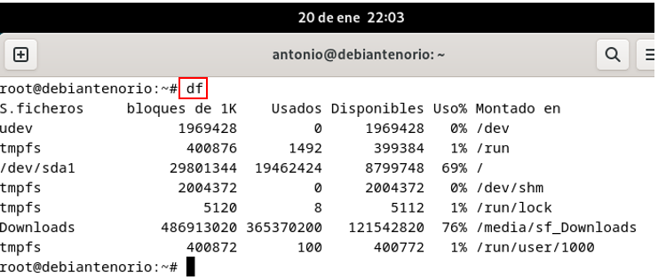
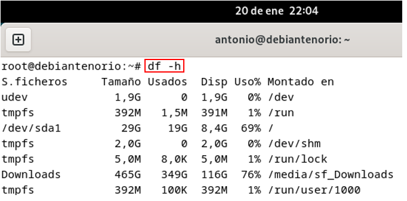
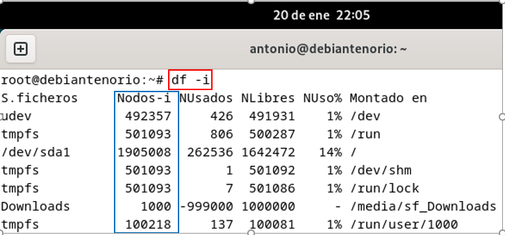
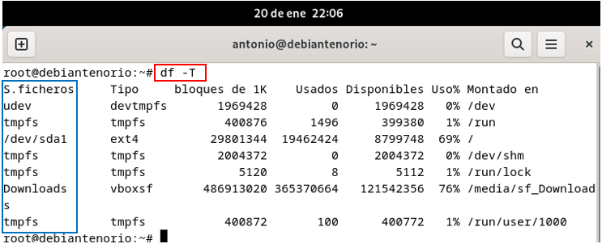

## 2.4	Comentario del resultado del comando.
-	**df**: Muestra información sistema de archivos montados, tipo, tamaño, etc.
-	**df -h**: Muestra los valores en un formato legible.
-	**df -i**: Muestra el uso de nodos-i en lugar del espacio en disco.
-	**df -T**: Muestra el tipo del sistema de archivos (ext4, tmpfs, etc.)
Descripción de las columnas:
-	__S. ficheros__: Nombre del dispositivo o sistema de archivos.
-	__Tipo__: Muestra el nombre del sistema de archivo.
-	__Tamaño__: Tamaño total del sistema de archivos.
-	__Usados__: Espacio usado actualmente.
-	__Disponibles__: Espacio disponible para nuevos datos.
-	__Uso%__: Porcentaje del sistema de archivos en uso.
-	__Montado en__: Punto de montaje donde está accesible el sistema de archivos.
  
## Comando du.
## 2.1	Explicación del comando.
El comando du en Linux se utiliza para estimar y mostrar el uso de espacio en disco de archivos y directorios. Es útil para identificar qué elementos están ocupando más espacio en el sistema.
## 2.2	Opciones comunes del comando.
-	**du**: Calcula el espacio que ocupan los directorios y archivos concretos.
-	**-h**: Muestra los tamaños en un formato legible para humanos (por ejemplo, 1K, 234M, 2G).
-	**-a**: Muestra el uso de espacio de archivos y directorios (por defecto solo muestra los directorios).
-	**-s**: Muestra solo el total de espacio utilizado por cada argumento proporcionado.
-	**-c**: Incluye un total acumulado al final de la salida.
-	**-d N**: Limita la profundidad de la inspección a N niveles de subdirectorios.
-	**--max-depth=N**: Igual que -d, pero con una sintaxis más explícita.
-	**-x**: Solo mide espacio dentro del mismo sistema de archivos (ignora otros sistemas montados).
-	**--time**: Muestra la última fecha de modificación junto con el tamaño.
## 2.3	Capturas de pantalla ejecutando las opciones.
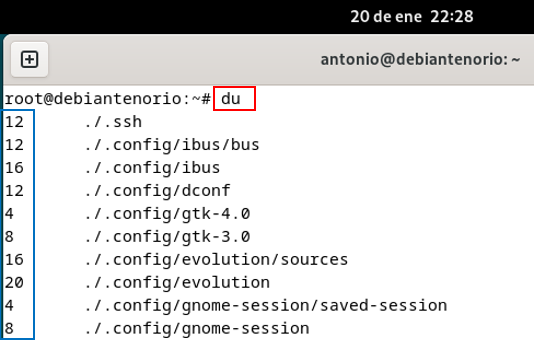
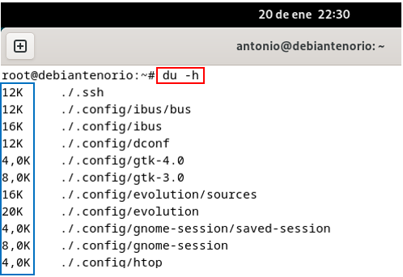
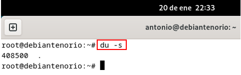
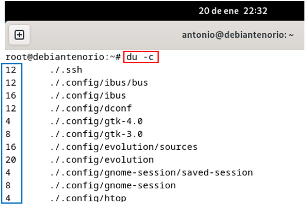

## 2.4	Comentario del resultado del comando.
-	**du**: Muestra el uso de espacio en disco de archivos y directorios.
-	**du -h**: Muestra los tamaños en un formato legible (KB, MB, GB).
-	**du -s**: Muestra sólo el tamaño total de la carpeta especificada.
-	**du -c**: Muestra el tamaño total al final de la salida.
  
## Comando iostat.
## 2.1	Explicación del comando.
El comando iostat (parte del paquete sysstat) proporciona estadísticas sobre el uso del procesador y la actividad de los dispositivos de almacenamiento en sistemas Unix/Linux. Es útil para monitorear el rendimiento del sistema, ayudando a identificar cuellos de botella relacionados con la CPU o el almacenamiento.

**Sintaxis básica**:
iostat [opciones] [intervalo] [conteo]

-	**intervalo**: Tiempo en segundos entre actualizaciones.
-	**conteo**: Número de actualizaciones que se realizarán.
## 2.2	Opciones comunes del comando.
-	**iostat**: Muestra estadísticas globales de CPU y dispositivos de almacenamiento.
-	**iostat -c**: Muestra solo las estadísticas de CPU.
-	**iostat -d**: Muestra solo las estadísticas de dispositivos de almacenamiento.
-	**iostat -x**: Proporciona estadísticas detalladas para cada dispositivo.
-	**iostat -t**: Incluye marcas de tiempo en la salida.
-	**iostat -p [dispositivo]**: Muestra estadísticas para un dispositivo específico (como /dev/sda).

Descripción de las columnas:
Uso de la CPU:
-	__%user__: Porcentaje de CPU utilizado por procesos de usuario.
-	__%system__: Porcentaje de CPU utilizado por el sistema (kernel).
-	__%idle__: Porcentaje de CPU inactiva.
-	__%iowait__: Tiempo que la CPU espera por operaciones de entrada/salida.

Dispositivos de almacenamiento:
-	**tps**: Operaciones de transferencia por segundo.
-	**kB_read/s**: Kilobytes leídos por segundo.
-	**kB_wrtn/s**: Kilobytes escritos por segundo.
-	**kB_read y kB_wrtn**: Total de kilobytes leídos y escritos desde que el sistema arrancó.
## 2.3	Capturas de pantalla ejecutando las opciones.
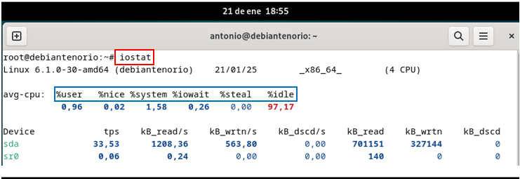

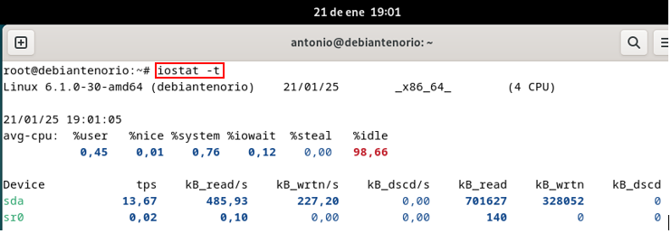
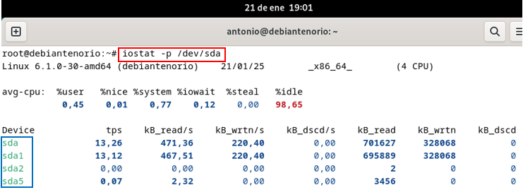

## 2.4	Comentario del resultado del comando.
-	**iostat**: Vemos estadísticas generales con porcentaje de cpu, operaciones de transferencia por segundos, kilobytes y total de estos.
-	**iostat -xd**: Nos muestra estadísticas detalladas de los dispositivos.
-	**iostat -t**: Nos muestra estadísticas con marcas de tiempo.
-	**iostat -p /dev/sda**: Nos muestra estadísticas solo para un disco específicado sda.
