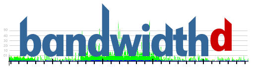

# 4.	Referencias.
Enlaces a la documentación oficial de los siguientes comandos:
-	ps: https://man7.org/linux/man-pages/man1/ps.1.html
-	top: https://man7.org/linux/man-pages/man1/top.1.html
-	htop: https://man7.org/linux/man-pages/man1/htop.1.html
-	atop: https://repost.aws/es/knowledge-center/ec2-linux-monitor-stats-with-atop
-	free: https://voidnull.es/free-el-comando-para-saber-todo-sobre-nuestra-ram/
-	df: https://man7.org/linux/man-pages/man1/df.1.html
-	du: https://man7.org/linux/man-pages/man1/du.1.html
-	iostat: https://man7.org/linux/man-pages/man1/iostat.1.html
-	tcpdump: https://man7.org/linux/man-pages/man1/tcpdump.1.html
-	tcptrack: https://linux.die.net/man/1/tcptrack
-	iptraf-ng: https://man7.org/linux/man-pages/man8/iptraf.8.html
-	netstat: https://man7.org/linux/man-pages/man8/netstat.8.html

# 5. Otras Herramientas y plataformas de monitorización.
## Bandwidthd.
Es una herramienta de monitorización de ancho de banda que utiliza un enfoque basado en captura de paquetes para generar informes detallados sobre el uso de la red. Está diseñada para administradores de red que necesitan visualizar y analizar el tráfico de una red en términos de uso de ancho de banda por protocolo, IP o incluso subred.

Enlace a la página oficial: https://bandwidthd.sourceforge.net/

## Nagios.
Es una potente herramienta de monitoreo de infraestructura utilizada para supervisar sistemas, redes y aplicaciones. Es ampliamente reconocida en el ámbito de TI por su capacidad de identificar y notificar problemas antes de que afecten a los usuarios finales o procesos empresariales.

  

Enlace a la página oficial: https://www.nagios.org/

## Zabbix.
Es una plataforma de monitoreo de código abierto diseñada para supervisar el desempeño de infraestructuras de TI, como redes, servidores, aplicaciones y servicios. Es una herramienta popular debido a su capacidad para manejar grandes entornos empresariales, escalabilidad y funcionalidades avanzadas.
